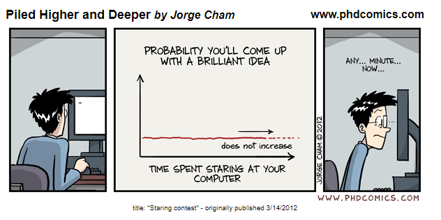
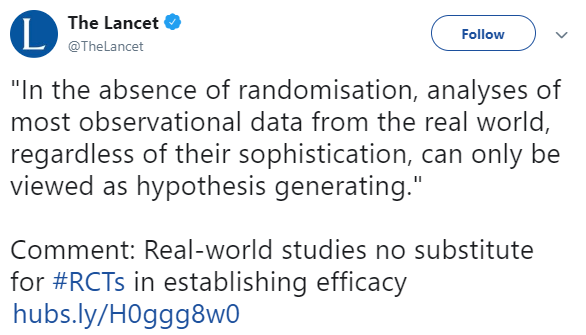
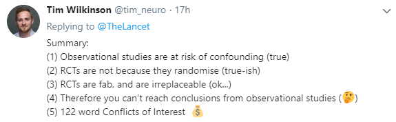
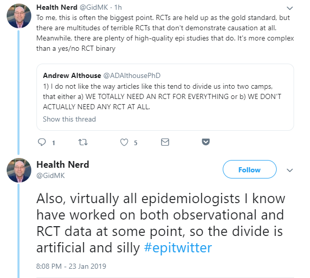

# 500 Class 01: 2023-01-19

[Main Website](https://thomaselove.github.io/500-2023/) | [Calendar](https://thomaselove.github.io/500-2023/calendar.html) | [Syllabus](https://thomaselove.github.io/500-syllabus-2023) | [Canvas](https://canvas.case.edu) | [Data/Code](https://github.com/THOMASELOVE/500-data) |  [Sources](https://github.com/THOMASELOVE/500-classes-2023/tree/main/sources) | For help, email
:-----------: | :--------------: | :----------: | :---------: | :-------------: | :------: | :-----------: 
links for everything | deadlines | expectations | zoom, submissions | downloads | to read | `Thomas` dot `Love` at `case` dot `edu`

## Today's Slides

Class | Date | PDF | Quarto .qmd | Recording
:---: | :--------: | :------: | :------: | :-------------:
01 | 2023-01-19 | **[Slides 01](https://github.com/THOMASELOVE/500-slides-2023/blob/main/slides01.pdf)** | **[Code 01](https://github.com/THOMASELOVE/500-slides-2023/blob/main/slides01.qmd)** | Visit [Canvas](https://canvas.case.edu/), select **Zoom** and **Cloud Recordings**

## Welcome to 500!

- Instructor: Thomas E. Love, Ph.D., Professor of Medicine and of Population and Quantitative Health Sciences, CWRU.
- Office Hours: By appointment, after class, or via email. Email address is **Thomas dot Love at case dot edu**.

Need help? Contact me with your questions. I want to hear from you!

---

## Logistics and Reminders

1. Please read the [Syllabus](https://thomaselove.github.io/500-syllabus-2023/) and familiarize yourself with the [Course Website](https://thomaselove.github.io/500-2023/), the Shared Google Drive (which you can see from your CWRU Google account as *500 Spring 2023 Dr Love and Students*), and [Canvas](https://canvas.case.edu/) so that if you have any questions or problems getting started, we can settle them quickly.
    - Questions should be emailed directly to me.
2. The course assignments include 5 labs, some essays, and a semester-long project with multiple elements. Complete instructions are available for all assignments at the [course website](https://thomaselove.github.io/500-2023/).
    - [Lab 0](https://thomaselove.github.io/500-2023/lab0.html) is worth your time and attention over the next week, so that the real Labs will be less daunting, and so that you can shake out your R installation/updating/skills.
    - [Lab 1](https://thomaselove.github.io/500-2023/lab1.html) is due Wednesday 2022-02-01 at 7 PM.
3. The final word on all deadlines is the [Course Calendar](https://thomaselove.github.io/500-2023/calendar.html). All deliverables for the entire semester are listed.
4. We expect you to attend all classes to facilitate our discussions (which will be a bigger part of the second half of the course.) All 500 classes are video-recorded, and the recordings will be archived in the Zoom section of [Canvas](https://canvas.case.edu). See our Shared Drive for details.

## References from Today's Class

Articles posted on our [Sources page](https://github.com/THOMASELOVE/500-classes-2023/tree/main/sources)

- Concato John et al. 2000 [Randomized, Controlled Trials, Observational Studies and the Hierarchy of Research Designs](https://github.com/THOMASELOVE/500-classes-2023/blob/main/sources/articles/Concato%20Shah%20and%20Horwitz%202000%20OS%20vs%20RCTs%20and%20Hierarchy%20of%20Research%20Design.pdf) *New England Journal of Medicine*
- Gum Patricia A Thamailarasan Maran Watanabe Junko et al. 2001 [Aspirin Use and All-Cause Mortality among Patients being Evaluated for Known or Suspected Coronary Artery Disease](https://github.com/THOMASELOVE/500-classes-2023/blob/main/sources/articles/Gum%202001%20JAMA%20Aspirin%20Use%20Propensity%20Analysis.pdf) *JAMA* 2001 286(10): 1187-1194.
- Smith Gordon C S and Pell Jill P 2003 [Parachute use to prevent death and major trauma related to gravitational challenge: Systematic review of randomized controlled trials](https://github.com/THOMASELOVE/500-classes-2023/blob/main/sources/articles/Smith%20and%20Pell%202003%20BMJ%20Parachutes.pdf) *The BMJ*

You might be interested as well in [The Book of Why](http://bayes.cs.ucla.edu/WHY/) by Judea Pearl and Dana Mackenzie in 2018.

Other articles I refer to in the slides, if you're interested in tracking down further details...

- Multiple risk factor intervention trial. Risk factor changes and mortality results. Multiple Risk Factor Intervention Trial Research Group. *JAMA* 1982 Sep 24;248(12):1465-77. [PubMed](https://pubmed.ncbi.nlm.nih.gov/7050440/)
- [USPSTF Grade Definitions](https://www.uspreventiveservicestaskforce.org/Page/Name/grade-definitions) including links to definitions prior to July 2012.
- Veterans Administration Coronary Artery Bypass Surgery Cooperative Study Group. Eleven-year survival in the Veterans Administration randomized trial of coronary bypass surgery for stable angina. *N Engl J Med* 1984 Nov 22;311(21):1333-9. doi: 10.1056/NEJM198411223112102. [PubMed](https://pubmed.ncbi.nlm.nih.gov/6333636/)

## Notes from the 431-432 Sequence

If you need them, the [431 Notes from Fall 2022 are here](https://thomaselove.github.io/431-notes/), and the [432 Notes for Spring 2023 are here](https://thomaselove.github.io/432-notes/).

## Learning about Quarto (and making the switch from R Markdown)

1. Virtually any code you have written in R Markdown can be run using Quarto instead, by simply switching the file extension from .Rmd to .qmd.
2. It's still worth it to learn about how Quarto works, and why it differs from R Markdown when it does.

Here are some suggestions:

- <https://quarto.org/> is the main website for all things Quarto, will help you get started making the transition, and has a detailed set of guides and references.
    - Here's the start of the [Tutorial, including Hello, Quarto](https://quarto.org/docs/get-started/hello/rstudio.html) that shows you how to use Quarto with RStudio, which is what you'll be doing in this class.
    - This [FAQ for R Markdown users](https://quarto.org/docs/faq/rmarkdown.html) might be a good starting point.
    - Alison Hill wrote a great blog post [We don't talk about Quarto](https://www.apreshill.com/blog/2022-04-we-dont-talk-about-quarto/) which got me started last April.
- [R for Data Science (2nd edition)](https://r4ds.hadley.nz/) has three chapters on [Communication](https://r4ds.hadley.nz/communicate.html) which include sections dedicated to Quarto, Quarto formats and a Quarto workflow.
- YouTube videos discussing Quarto that may be of interest to you include (in no special order):
    - From Tom Mock at Posit (new name of RStudio the company)
        - [Quarto for the Curious](https://www.youtube.com/watch?v=mrvhk2XUfWo) (runs 21 minutes)
        - [Welcome to Quarto workshop](https://www.youtube.com/watch?v=yvi5uXQMvu4) (2 hours 23 minutes)
        - [Beautiful Reports and Presentations with Quarto](https://www.youtube.com/watch?v=hbf7Ai3jnxY) (1 hour 45 minutes)
        - [Create & Publish a Quarto Blog on Quarto Pub in 100 Seconds](https://www.youtube.com/watch?v=t8qtcDyCRFA) (2 minutes).
        - [Reproducible Medical Research with Quarto](https://www.youtube.com/watch?v=KnwQFph3s94) (3 hours 15 minutes)
    - Isabella Velásquez: [Building a Blog with Quarto](https://www.youtube.com/watch?v=CVcvXfRyfE0) (1 hour 13 minutes)
    - Devin Pastoor: [Websites & Books & Blogs, oh my! Creating Rich Content with Quarto](https://www.youtube.com/watch?v=A9QRN4cpsDY) (21 minutes)
    - Frank Harrell: [R Workflow for Reproducible Biomedical Research using Quarto](https://www.youtube.com/watch?v=NCrrN3Al-kw) (1 hour, 2 minutes)
    - Lyndon Walker: [Create beautiful documents with Quarto and R](https://www.youtube.com/watch?v=y5VcxMOnj3M) (29 minutes)
    - Mine Çetinkaya-Rundel: [Hello, Quarto!](https://www.youtube.com/watch?v=YVa5cdkypbw)
    - Ted Laderas on [Quarto/R Markdown: What's Different?](https://www.youtube.com/watch?v=xC6I5OVOnKI) (28 minutes)

## One Last Thing

I am in a play that runs on Friday and Saturday evenings at 8 PM starting January 27 and running through February 18 at [Aurora Community Theatre](https://www.auroracommunitytheatre.com/), in Aurora, Ohio. I'm always delighted to see anyone I know at any show I do. Please do come if you are interested, and if you are comfortable being around people who are unmasked. 

It's called "[The Play That Goes Wrong](https://www.youtube.com/watch?v=DOWO4gq-whg)." It is widely regarded as one of the funniest plays ever produced, and is sometimes referred to as a hybrid of Monty Python and Sherlock Holmes. I am playing a leading role, that of Chris, the play's director and one of its stars, and I'm not going to tell you anything more about it, except that I am exceedingly proud of the show, and think you will like it. 

If you'd like to come, that would be great, and all of the information you need to buy tickets (they are **selling very quickly**) is available by clicking the "Buy Tickets" link at <https://www.auroracommunitytheatre.com/>. The theater is about a 40-45 minute drive from the CWRU campus, east and south of Cleveland. Thank you.

If you wouldn't like to come, that's **100% OK**. I have various professional roles (as a teacher, for example) where I have some nominal control over other people's happiness or work. If you're someone who interacts with me professionally, please feel no obligation to attend a show I'm in. Attending (or not attending) a show I'm in carries no weight with me at all in any professional capacity.
