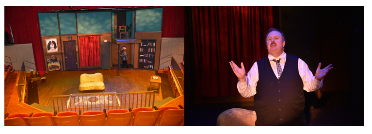

# 500 Class 05: 2023-02-16

[Main Website](https://thomaselove.github.io/500-2023/) | [Calendar](https://thomaselove.github.io/500-2023/calendar.html) | [Syllabus](https://thomaselove.github.io/500-syllabus-2023) | [Canvas](https://canvas.case.edu) | [Data/Code](https://github.com/THOMASELOVE/500-data) |  [Sources](https://github.com/THOMASELOVE/500-classes-2023/tree/main/sources) | For help, email
:-----------: | :--------------: | :----------: | :---------: | :-------------: | :------: | :-----------: 
links for everything | deadlines | expectations | zoom, submissions | downloads | to read | `Thomas` dot `Love` at `case` dot `edu`

## Today's Slides

Class | Date | PDF | Quarto .qmd | Recording
:---: | :--------: | :------: | :------: | :-------------:
05 | 2023-02-16 | **[Slides 05](https://github.com/THOMASELOVE/500-slides-2023/blob/main/500_slides05.pdf)** | **[Code 05](https://github.com/THOMASELOVE/500-slides-2023/blob/main/500_slides05.qmd)** | Visit [Canvas](https://canvas.case.edu/), select **Zoom** and **Cloud Recordings**

## Today's Agenda

1. Our R Examples So Far
    - [The toy example](https://github.com/THOMASELOVE/500-data/tree/master/toy) (discussed in Class 04)
    - [The lindner example](https://github.com/THOMASELOVE/500-data/tree/master/lindner) (lightly touched on in Class 04)
2. [The dm2200 example](https://github.com/THOMASELOVE/500-data/tree/master/dm2200) (new today)
    - The MatchIt and Matching packages
    - Varying the Matching Structure
3. Matching with (or without) a Propensity Score
4. Discussion of [OSIA Claims and Scheduling](https://github.com/THOMASELOVE/500-osia-2023/blob/main/claims.md)
5. Rosenbaum, Chapters 1-4
6. Feinstein's Model for Research Architecture
7. Extending "Matching" in a few other ways

## What Should I Be Working On?

1. [Project Proposal (draft 1)](https://thomaselove.github.io/500-2023/proj500.html) is due to Canvas at 7 PM on Wednesday 2023-02-22.
    - You'll also present your idea orally in class on 2023-02-23 (this "presentation" will just be you briefly summarizing your data source, outcome, treatment and covariates from your seat - no slides and it shouldn't take more than two minutes, each.)
    - The second and final version of your Proposal is due on Wednesday 2023-03-08.
2. Lab 3 is due to Canvas at 7 PM the following Wednesday 2023-03-01.

## Can I Still See Your Show?

We have fewer than 20 seats available for each of our final two performances of The Play That Goes Wrong, this Friday and Saturday at 8 PM. Visit https://www.auroracommunitytheatre.com/ for tickets.

