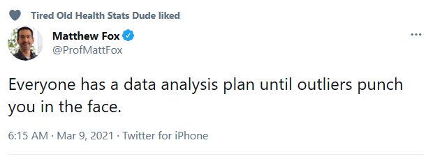
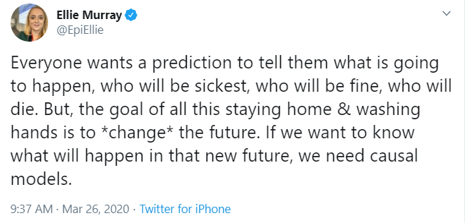

# 500 Class 08: 2023-03-09

[Main Website](https://thomaselove.github.io/500-2023/) | [Calendar](https://thomaselove.github.io/500-2023/calendar.html) | [Syllabus](https://thomaselove.github.io/500-syllabus-2023) | [Canvas](https://canvas.case.edu) | [Data/Code](https://github.com/THOMASELOVE/500-data) |  [Sources](https://github.com/THOMASELOVE/500-classes-2023/tree/main/sources) | For help, email
:-----------: | :--------------: | :----------: | :---------: | :-------------: | :------: | :-----------: 
links for everything | deadlines | expectations | zoom, submissions | downloads | to read | `Thomas` dot `Love` at `case` dot `edu`

## Today's Slides

Class | Date | PDF | Quarto .qmd | Recording
:---: | :--------: | :------: | :------: | :-------------:
08 | 2023-03-09 | **[Slides 08](https://github.com/THOMASELOVE/500-slides-2023/blob/main/500_slides08.pdf)** | **[Code 08](https://github.com/THOMASELOVE/500-slides-2023/blob/main/500_slides08.qmd)** | Visit [Canvas](https://canvas.case.edu/), select **Zoom** and **Cloud Recordings**

## Today's Agenda

1. We'll quickly verify the schedule and plans for OSIA presentations. [See here for the schedule](https://github.com/THOMASELOVE/500-osia-2023/blob/main/claims.md).
2. The [Right Heart Catheterization example](https://github.com/THOMASELOVE/500-data/tree/master/rhc) is now complete, including the sensitivity analysis material.
3. We will discuss sensitivity analysis for matched samples.
4. We will discuss the status of your project proposals, the "final" version of which you submitted last night. 
5. We will also discuss Rosenbaum Chapter 7. There is an [essay prompt for Chapter 7](https://github.com/THOMASELOVE/500-2022/tree/main/essays#prompt-for-chapter-7-elaborate-theories), which is worth looking at in advance, but there is no need to pre-develop an essay for Class 08.

Remember that next week is the CWRU Spring Break. We will not hold class again until two weeks from today: 2023-03-23. I will check email only daily during the Break.

## Sensitivity Spreadsheet Information

- The Excel sheet (developed in 2008) is available in our Shared Drive in the Sensitivity Spreadsheet folder.
- The PDF description of what the spreadsheet does (with examples) is also found in our Shared Drive in the Sensitivity Spreadsheet folder.

## What Should I Be Working On?

1. Please read Rosenbaum Chapter 11 and complete the [Essay associated with that chapter](https://github.com/THOMASELOVE/500-2022/tree/main/essays#prompt-for-chapter-11-matching-techniques-to-be-discussed-on-2022-03-17) and submit it to our Shared Drive by 8 AM on 2022-03-17, before our next class.
2. OSIA schedule for our next class is [here](https://github.com/THOMASELOVE/500-2022/blob/main/osia/claims.md).
    - Callie, Monika and Asma will be our primary readers, and will [submit their 15-20 slides](https://github.com/THOMASELOVE/500-2022/tree/main/osia#for-the-primary-reviewer) for their presentations to our Shared Google Drive in the OSIA 2022-03-17 folder by 3 PM on Wednesday 2022-03-16. 
    - Leila, Emily and Raunak will be our second readers, and will [submit their 2-4 slides](https://github.com/THOMASELOVE/500-2022/tree/main/osia#for-the-second-reviewer) for their presentations to our Shared Google Drive in the OSIA ... Slides for 2022-03-17 folder by 8 AM on Thursday 2022-03-17.
    - Everyone else is responsible to read the [abstracts of these three papers](https://github.com/THOMASELOVE/500-2022/blob/main/osia/claims.md#group-1-discussion-on-2022-03-17) in advance, so that you can contribute more meaningfully to the discussion. 
3. 

